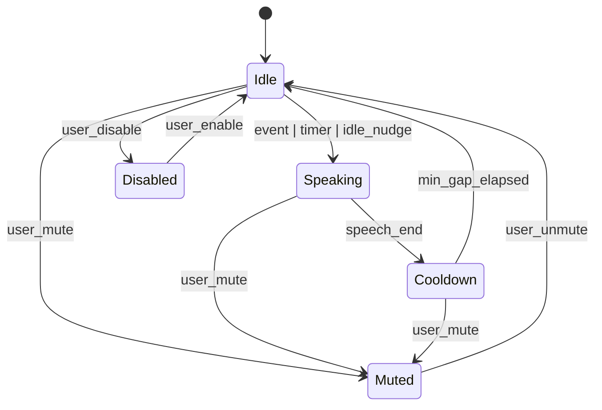

# WO-2026-139 Ambient Audio Narration Research

**Status: Research Complete**

## Goal
Explore how to add periodic voice narration that describes what the agent is doing on the landing page, without being constant or overwhelming.

## TTS Options Survey

| Option | Pros | Cons | Notes |
| --- | --- | --- | --- |
| Browser Web Speech API | Zero backend, free, low latency, works offline with OS voices | Voice quality varies by device, inconsistent voice list, some browsers limit controls | Best for v0; provides instant playback and no infra |
| ElevenLabs | High quality, expressive voices, voice cloning | Paid per character, network dependency, latency, privacy considerations | Good for premium voice mode or demos |
| OpenAI TTS | Strong quality, simple API, predictable | Paid per character, network dependency, latency | Solid middle ground for quality vs setup |
| Google Cloud TTS | Large voice catalog, enterprise support | More setup, paid per character, network dependency | Good if already on GCP |
| Pre-recorded snippets + dynamic assembly | Consistent voice, no runtime TTS costs, fast | Limited flexibility, awkward stitching if too many fragments | Works for fixed phrases + light variable slots |

**Recommendation (research)**:
- Start with Web Speech API for local-first, no-infra narration.
- Offer optional premium voice mode (OpenAI or ElevenLabs) if quality matters.
- Use a small library of pre-recorded stingers for key events (e.g., "Run completed") to improve consistency without full TTS dependency.

## Narration Triggers (What causes speech)

**Event-driven (highest priority)**
- Run started (announce WO title + goal).
- Run phase changes (build, tests, review, merge).
- Run completed (success or failure).
- Escalation requested (system is waiting on input).
- New work order enters Ready or Active (if visible).

**Periodic (ambient)**
- Summaries every 45-75s when there is active work.
- Only if there were no event-driven narrations during the window.

**Idle-driven (re-engagement)**
- After 60-120s of user inactivity, speak a short status reminder.
- Only once per idle period to avoid nagging.

**Threshold-driven (notable change)**
- Success rate changes by a threshold (e.g., 10%).
- Queue size changes significantly (e.g., +3 WOs).
- Run failure rate spikes in the last N runs.

**Gating rules**
- No narration while muted or during cooldown.
- Event-driven narration resets the periodic timer.
- Drop low-priority narrations if a higher-priority one is queued.

## Content Templates (What it says)

**Start**
- "Starting work on {wo_title}. Goal: {wo_goal}."
- "The agent just picked up {wo_title}. Here is the plan: {short_plan}."

**Progress**
- "Currently building changes for {wo_title}."
- "Tests are running for {wo_title}. I will share results soon."

**Outcome**
- "Run complete for {wo_title}. Status: {run_status}."
- "Reviewer feedback is in. {review_summary}."

**System summary**
- "{active_count} work orders are active. {ready_count} are ready."
- "Average success rate is {success_rate} percent over the last {window} runs."

**Idle nudge**
- "Nothing new just yet. The agent is still working on {wo_title}."
- "I will speak up when the next milestone lands."

**Escalation**
- "The system is waiting for input: {escalation_summary}."
- "We need a quick decision to continue: {escalation_prompt}."

**Tone guidance**
- 1-2 short sentences per narration.
- Avoid jargon; explain acronyms on first use.
- Prefer calm, matter-of-fact phrasing.

## Pacing & Frequency

- Minimum gap between narrations: 25-35s.
- Target cadence during active work: 45-75s.
- Max silence during active work: 120s (a single summary if quiet).
- Do not narrate more than once per event burst; collapse into a single summary.
- If the user interacts (scroll, click), reset idle timers.

## Visitor Controls

- Visible toggle: "Narration On/Off" (persistent across sessions).
- Mute button always visible and sticky on the landing page.
- Optional volume slider (only if audio is on).
- Default: off until user explicitly enables, or soft prompt ("Enable narration?").
- Provide a text transcript or captions for accessibility and silent viewing.

## Data Sources for Narration Content

- Run lifecycle data (status, phase, timestamps) from the server API.
- Active work order data (title, goal, current status) from API, not markdown files.
- Shift context: current run, last action, active agent state.
- Aggregates: success rate, run count, queue sizes (from DB via API).
- Escalation payloads (waiting_for_input summary).
- User activity signals (last interaction timestamp, viewport focus).

## Narration State Machine (Sketch)

## Open Questions / Follow-ups

- Default setting: should narration prompt on first visit or remain silent?
- Do we want a single signature voice or multiple voices by agent role?
- Should event narration be suppressed while a user is actively reading?
