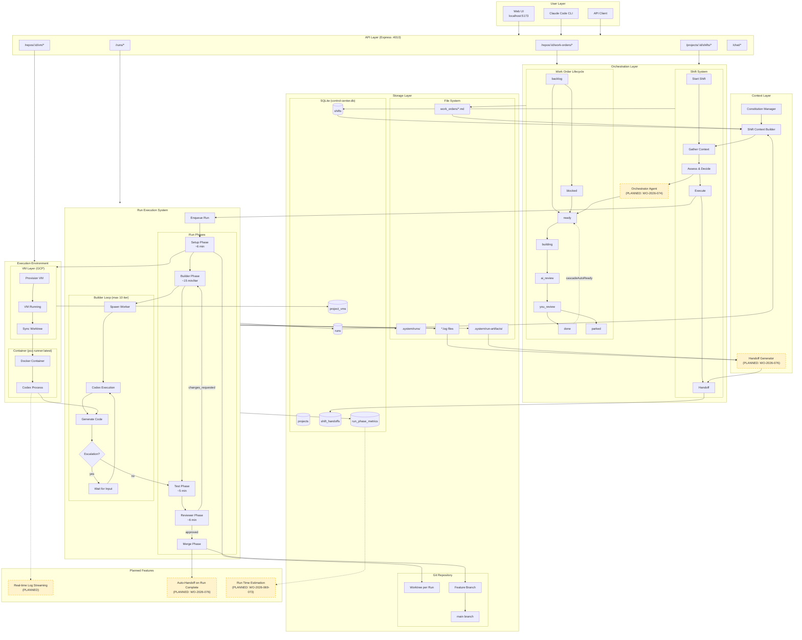

# PCC System Architecture



## Component Details

### Work Order Lifecycle
| Status | Description |
|--------|-------------|
| `backlog` | Not ready for work |
| `ready` | Ready to be picked up |
| `building` | Run in progress |
| `ai_review` | AI reviewing changes |
| `you_review` | Awaiting human review |
| `done` | Completed |
| `blocked` | Dependencies not met |
| `parked` | Paused/deferred |

### Run Phases
| Phase | Avg Duration | Description |
|-------|--------------|-------------|
| Setup | ~6 min | VM provision, worktree sync, deps install |
| Builder | ~15 min/iter | Code generation via Codex |
| Test | ~5 min | Run test suite |
| Reviewer | ~6 min | AI review of changes |
| Merge | ~1 min | Create PR, merge to main |

### Shift Lifecycle
1. **Start** - Create shift with timeout (default 120 min)
2. **Context** - Gather project state, WOs, runs, git status
3. **Assess & Decide** - Choose which WO to work on
4. **Execute** - Kick off runs, monitor progress
5. **Handoff** - Document work done, blockers, recommendations

### Planned Components (Yellow/Dashed)
- **WO-2026-074**: Orchestrator agent for autonomous shift management
- **WO-2026-076**: Auto-generate handoffs from run logs using Claude
- **WO-2026-069-073**: Run time estimation system
- **Real-time Logs**: Stream VM container logs live

## Data Flow

```
User Request
    ↓
API Endpoint
    ↓
Orchestration (Shift/WO selection)
    ↓
Run Enqueue
    ↓
VM Provision → Container Spawn → Codex Execute
    ↓
Builder → Test → Reviewer (loop if needed)
    ↓
Merge → Auto-Handoff (planned)
    ↓
Shift Complete → Next Shift
```
